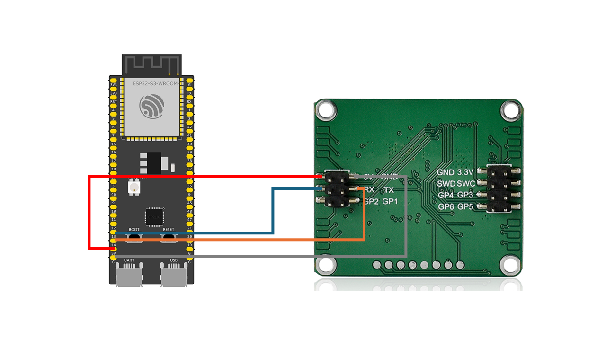

# R60ABD1


R60ABD1 radar module is the use of 60G millimeter wave radar technology, detection of human skin subtle changes, through the algorithm to calculate the respiratory frequency, heartbeat frequency, motion amplitude, abnormal activity information; And can be based on continuous detection, output sleep analysis report. Read [Document](./document_V3.4.pdf) for details.

R60ABD1 does not have wireless communication capabilities, so if you want R60ABD1 communicate with HomeAssistant, you need to use other communication modules (such as esp32) and flash firmware(such as ESPHome) interagted with R60ABD1 component. This guide aims to help users quickly get the R60ABD1 into HomeAssistant.

## Preparation
* [R60ABD1](https://www.micradar.cn/), with firmware version G60SM1SYv010204. Follow flashing instructions in [Flash Guide](./flash_guide.pdf) and flash [/docs/r60abd1/firmware_G60SM1SYv010204.bin](./firmware_G60SM1SYv010204.bin) into R60ABD1.
* [HomeAssistant](https://www.home-assistant.io/), latest version is recommended.
* [ESPHome](https://esphome.io/), latest version is recommended.
* [ESP32/ESP32-S3/ESP32-S2/ESP32-C3](https://www.espressif.com/), ESP32-S3 is recommended. In this guide, we will use ESP32-S3: **GPIO14 (ESP32-S3 RX) to R60ABD1 TX**, **GPIO15 (ESP32-S3 TX) to R60ABD1 RX**. The wiring diagram could be:
.

## Installation
In this guide, we provide an example.yaml file that can be directly imported into HomeAssistant:

```yaml

esphome:
  name: mmwave
  friendly_name: mmwave
  # Automatically add the mac address to the name
  # so you can use a single firmware for all devices
  name_add_mac_suffix: true
    # This will allow for project identification,
  # configuration and updates.
  project:
    name: zomco.mmwave
    version: dev # This will be replaced by the github workflows with the `release` version

# To be able to get logs from the device via serial and api.
logger:

# API is a requirement of the dashboard import.
api:

# OTA is required for Over-the-Air updating
ota:
  - platform: esphome

wifi:
  # Set up a wifi access point using the device name above
  ap:

# In combination with the `ap` this allows the user
# to provision wifi credentials to the device.
captive_portal:

# Sets up Bluetooth LE (Only on ESP32) to allow the user
# to provision wifi credentials to the device.
esp32_improv:
  authorizer: none

# Sets up the improv via serial client for Wi-Fi provisioning.
# Handy if your device has a usb port for the user to add credentials when they first get it.
improv_serial:

# This should point to the public location of the yaml file that will be adopted.
# In this case it is the core yaml file that does not contain the extra things
# that are provided by this factory yaml file as the user does not need these once adopted.
dashboard_import:
  package_import_url: github://zomco/mmwave-esphome-component/mmwave-common.yaml@main
  
external_components:
  # Include the r60abd1 component
  - source: https://github.com/zomco/mmwave-esphome-component
    component: r60abd1

esp32:
  board: esp32-s3-devkitc-1
  framework:
    type: esp-idf

# Configure the UART bus
uart:
  id: uart_bus
  tx_pin: GPIO13
  rx_pin: GPIO14
  baud_rate: 115200

# Configure the component hub
r60abd1:
  id: radar_hub
  uart_id: uart_bus

# Configure Sensors
sensor:
  - platform: r60abd1 
    id: radar_hub 
    distance:
      name: "Distance" # Home Assistant 中显示的名称
      # unit_of_measurement, icon 等在 sensor.py 中定义
      # 如果需要，可以在此处覆盖它们，例如：
      # icon: "mdi:map-marker-radius"
    motion_state:
      name: "Motion State" # 0:无, 1:静止, 2:活跃
    body_movement:
      name: "Body Movement" # 0-100
    heart_rate:
      name: "Heart Rate" # bpm
      filters:
        - range:
            min: 30.0
            max: 200.0
    respiration_rate:
      name: "Respiration Rate" # rpm
      filters:
        - range:
            min: 1.0
            max: 50.0
    sleep_score:
      name: "Sleep Score" # 0-100
    position_x:
      name: "Position X" # cm
    position_y:
      name: "Position Y" # cm
    position_z:
      name: "Position Z" # cm
    heart_rate_wave_0:
      name: "Heart Rate Wave 0" # 心率波形数据
    heart_rate_wave_1:
      name: "Heart Rate Wave 1" # 心率波形数据
    heart_rate_wave_2:
      name: "Heart Rate Wave 2" # 心率波形数据
    heart_rate_wave_3:
      name: "Heart Rate Wave 3" # 心率波形数据
    heart_rate_wave_4:
      name: "Heart Rate Wave 4" # 心率波形数据
    respiration_wave_0:
      name: "Respiration Wave 0" # 呼吸波形数据
    respiration_wave_1:
      name: "Respiration Wave 1" # 呼吸波形数据
    respiration_wave_2:
      name: "Respiration Wave 2" # 呼吸波形数据
    respiration_wave_3:
      name: "Respiration Wave 3" # 呼吸波形数据
    respiration_wave_4:
      name: "Respiration Wave 4" # 呼吸波形数据

# Configure Binary Sensors
binary_sensor:
  - platform: r60abd1
    id: radar_hub # 链接到核心
    presence:
      name: "Presence" # true: 有人, false: 无人
    bed_status:
      name: "Bed Status" # true: 在床, false: 离床

# Configure Text Sensors
text_sensor:
  - platform: r60abd1
    id: radar_hub # 链接到核心
    motion_text:
      name: "Motion Text" # 无, 静止, 活跃
    respiration_info:
      name: "Respiration Info" # 正常, 过高, 过低, 无
    sleep_stage:
      name: "Sleep Stage" # 深睡, 浅睡, 清醒, 无
    firmware_version:
      name: "Firmware Version" # 显示雷达的固件版本号
    sleep_rating:
      name: "Sleep Rating" # 显示睡眠评分

# --- Configure Control Entities ---

# Configure Switches
switch:
  - platform: r60abd1
    id: radar_hub # 链接到核心
    presence_detection: # 对应 switch.py 中的 key
      name: "Presence Detection" # 设置是否启用 Presence Detection
    heart_rate_detection:
      name: "Heart Rate Detection" # 设置是否启用 Heart Rate Detection
    respiration_detection:
      name: "Respiration Detection" # 设置是否启用 Respiration Detection
    sleep_monitoring:
      name: "Sleep Monitoring" # 设置是否启用 Sleep Monitoring
    heart_rate_waveform:
      name: "Heart Rate Waveform" # 设置是否启用 Heart Rate Waveform
    respiration_waveform:
      name: "Respiration Waveform" # 设置是否启用 Respiration Waveform
    struggle_detection:
      name: "Struggle Detection" # 设置是否启用 Struggle Detection
    unattended_detection:
      name: "Unattended Detection" # 设置是否启用 Unattended Detection

# Configure Numbers
number:
  - platform: r60abd1
    id: radar_hub # 链接到核心
    respiration_low_threshold: # 对应 number.py 中的 key
      name: "Respiration Low Threshold" # 设置呼吸率低于多少时报告“过低”
      # min/max/step 在 number.py 中定义 (10-20 rpm, step 1)
    unattended_time:
      name: "Unattended Time" # 设置无人多久后触发“无人计时异常”
      # min/max/step 在 number.py 中定义 (30-180 min, step 10)
    sleep_end_time:
      name: "Sleep End Time" # 设置离床多久后判断睡眠结束
      # min/max/step 在 number.py 中定义 (5-120 min, step 1)

# Configure Selects
select:
  - platform: r60abd1
    id: radar_hub # 链接到核心
    struggle_sensitivity: # 对应 select.py 中的 key
      name: "Stuggle Sensitivity" # 设置异常挣扎检测的灵敏度
      # options 在 select.py 中定义 (Low, Medium, High)
```