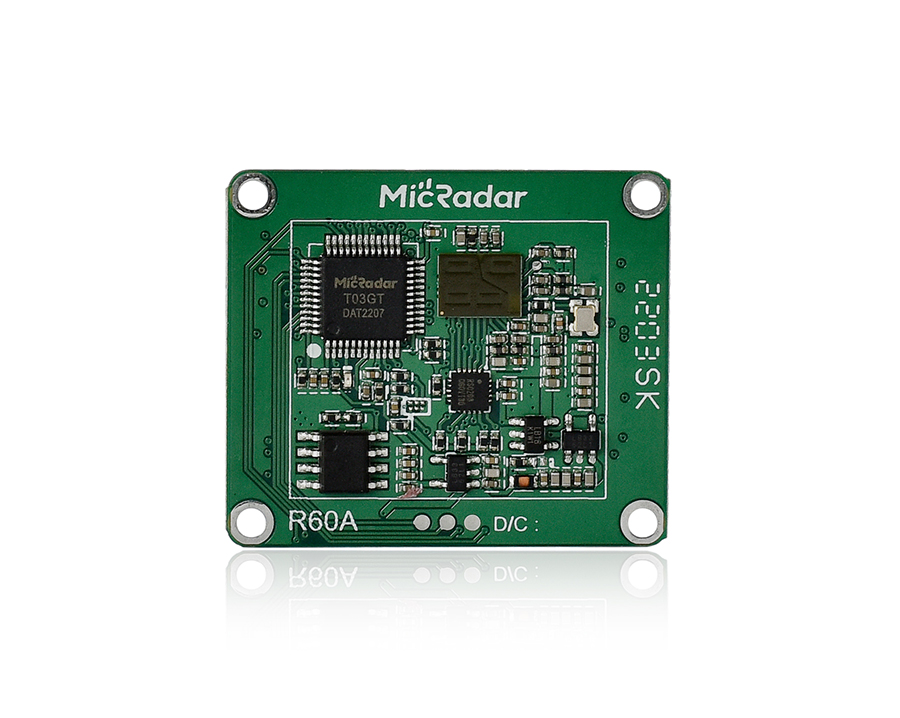
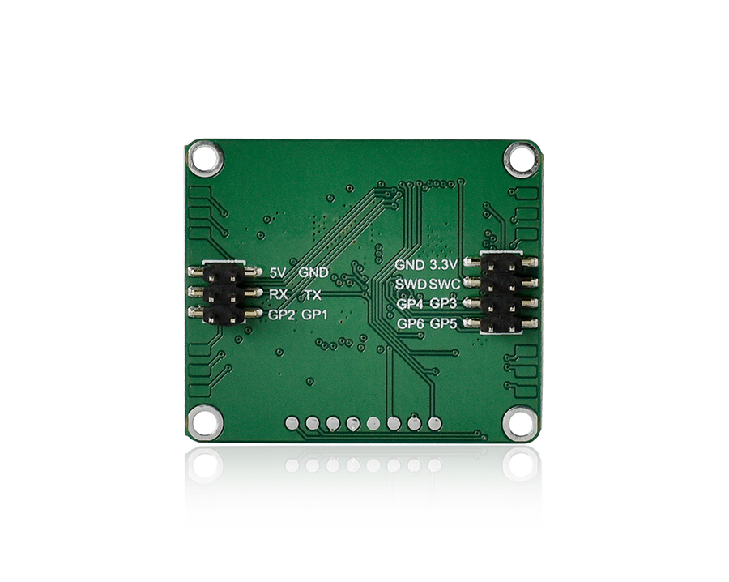

# R60ABD1

R60ABD1 radar module is the use of 60G millimeter wave radar technology, detection of human skin subtle changes, through the algorithm to calculate the respiratory frequency, heartbeat frequency, motion amplitude, abnormal activity information; And can be based on continuous detection, output sleep analysis report. Read [Document](./document_V3.4.pdf) for details.

R60ABD1 does not have wireless communication capabilities, so if you want R60ABD1 communicate with HomeAssistant, you need to use other communication modules (such as esp32) and flash firmware(such as ESPHome) interagted with R60ABD1 component. This guide aims to help users quickly get the R60ABD1 into HomeAssistant.

## Preparation
* [R60ABD1](https://www.micradar.cn/), with firmware version G60SM1SYv010204. Follow flashing instructions in [Flash Guide](./flash_guide.pdf) and flash [/docs/r60abd1/firmware_G60SM1SYv010204.bin](./firmware_G60SM1SYv010204.bin) into R60ABD1.
* [HomeAssistant](https://www.home-assistant.io/), latest version is recommended.
* [ESPHome](https://esphome.io/), latest version is recommended.
* [ESP32/ESP32-S3/ESP32-S2/ESP32-C3](https://www.espressif.com/), ESP32-S3 is recommended.

