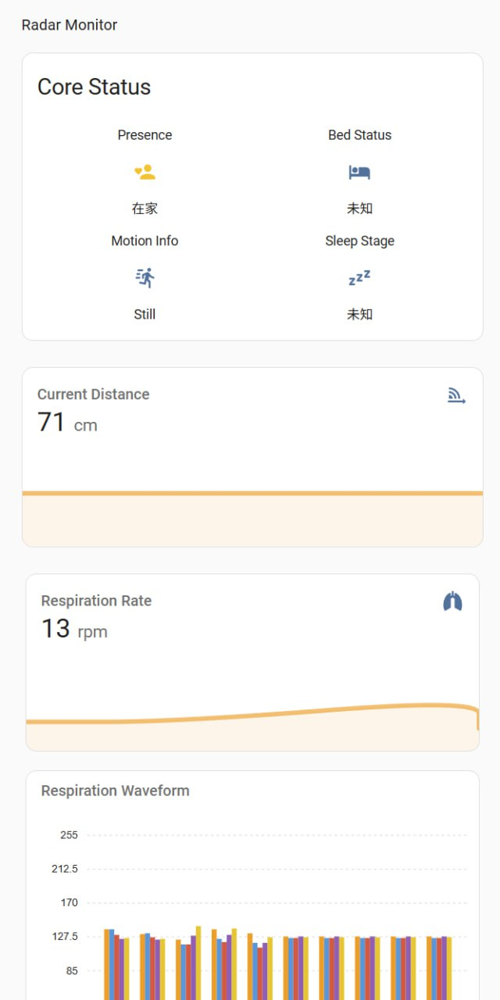
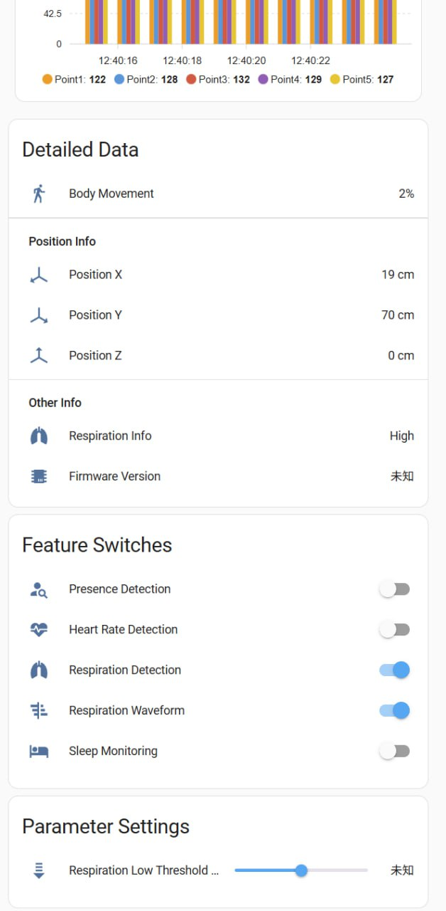

# R60ABD1


R60ABD1 radar module is the use of 60G millimeter wave radar technology, detection of human skin subtle changes, through the algorithm to calculate the respiratory frequency, heartbeat frequency, motion amplitude, abnormal activity information; And can be based on continuous detection, output sleep analysis report. Read [Document](./document_V3.4.pdf) for details.

R60ABD1 does not have wireless communication capabilities, so if you want R60ABD1 communicate with HomeAssistant, you need to use other communication modules (such as esp32) and flash firmware(such as ESPHome) interagted with R60ABD1 component. This guide aims to help users quickly get the R60ABD1 into HomeAssistant.

## Preparation
* [R60ABD1](https://www.micradar.cn/), with firmware version G60SM1SYv010204. Follow flashing instructions in [Flash Guide](./flash_guide.pdf) and flash [/docs/r60abd1/firmware_G60SM1SYv010204.bin](./firmware_G60SM1SYv010204.bin) into R60ABD1.
* [HomeAssistant](https://www.home-assistant.io/), latest version is recommended.
* [ESPHome](https://esphome.io/), latest version is recommended.
* [ESP32/ESP32-S3/ESP32-S2/ESP32-C3](https://www.espressif.com/), ESP32-S3 is recommended. In this guide, we will use ESP32-S3: **GPIO14 (ESP32-S3 RX) to R60ABD1 TX**, **GPIO15 (ESP32-S3 TX) to R60ABD1 RX**. The wiring diagram could be:
.

## Installation

### Basic(recommended)

### Advanced
In this guide, we provide some sample configuration that help you customize the R60ABD1. Replace **##REPLACE_NAME##** with your device name in the configuration and follow the [installation instructions](https://esphome.io/guides/getting_started_hassio).:

```yaml
esphome:
  name: ##REPLACE_NAME##

esp32:
  board: esp32-s3-devkitc-1
  framework:
    type: esp-idf

captive_portal:

external_components:
  - source:
      type: git
      path: https://github.com/zomco/mmwave-esphome-component
    components: [r60abd1]
  
# Configure the UART bus
uart:
  id: uart_bus
  tx_pin: GPIO14
  rx_pin: GPIO13
  baud_rate: 115200
  debug:

# Configure the component hub
r60abd1:
  id: radar_hub
  uart_id: uart_bus

# Configure Sensors
sensor:
  - platform: r60abd1 
    distance:
      name: "Distance"
    body_movement:
      name: "Body Movement"
    heart_rate:
      name: "Heart Rate"
    respiration_rate:
      name: "Respiration Rate"
    sleep_score:
      name: "Sleep Score"
    position_x:
      name: "Position X"
    position_y:
      name: "Position Y"
    position_z:
      name: "Position Z"
    heart_rate_waveform_pt0:
      name: "Heart Rate Waveform Point0"
    heart_rate_waveform_pt1:
      name: "Heart Rate Waveform Point1"
    heart_rate_waveform_pt2:
      name: "Heart Rate Waveform Point2"
    heart_rate_waveform_pt3:
      name: "Heart Rate Waveform Point3"
    heart_rate_waveform_pt4:
      name: "Heart Rate Waveform Point4"
    respiration_waveform_pt0:
      name: "Respiration Waveform Point0"
    respiration_waveform_pt1:
      name: "Respiration Waveform Point1"
    respiration_waveform_pt2:
      name: "Respiration Waveform Point2"
    respiration_waveform_pt3:
      name: "Respiration Waveform Point3"
    respiration_waveform_pt4:
      name: "Respiration Waveform Point4"

# Configure Binary Sensors
binary_sensor:
  - platform: r60abd1
    presence:
      name: "Presence"
    bed_status:
      name: "Bed Status"

# Configure Text Sensors
text_sensor:
  - platform: r60abd1
    motion_info:
      name: "Motion Info"
    respiration_info:
      name: "Respiration Info"
    sleep_stage:
      name: "Sleep Stage"
    firmware_version:
      name: "Firmware Version"
    sleep_rating:
      name: "Sleep Rating"

# --- Configure Control Entities ---

# Configure Switches
switch:
  - platform: r60abd1
    presence_detection:
      name: "Presence Detection"
    heart_rate_detection:
      name: "Heart Rate Detection"
    respiration_detection:
      name: "Respiration Detection"
    sleep_monitoring:
      name: "Sleep Monitoring"
    heart_rate_waveform:
      name: "Heart Rate Waveform"
    respiration_waveform:
      name: "Respiration Waveform"
    struggle_detection:
      name: "Struggle Detection"
    unattended_detection:
      name: "Unattended Detection"

# Configure Numbers
number:
  - platform: r60abd1
    respiration_low_threshold:
      name: "Respiration Low Threshold"
    unattended_time:
      name: "Unattended Time"
    sleep_end_time:
      name: "Sleep End Time"

# Configure Selects
select:
  - platform: r60abd1
    struggle_sensitivity:
      name: "Struggle Sensitivity"

```

## Configuration
After installation, the new device can be added to HomeAssistant. You may need to add the new device to dashboard to view the data, we also provide some sample configuration. To use the sample configuration, [layout-card](https://github.com/thomasloven/lovelace-layout-card) and [apexcharts-card](https://github.com/RomRider/apexcharts-card) are required.

```yaml
path: radar-monitor
panel: true
icon: mdi:radar
badges:
  - entity: binary_sensor.##REPLACE_NAME##_presence
    name: Presence
  - entity: binary_sensor.##REPLACE_NAME##_bed_status
    name: Bed Status
  - entity: sensor.##REPLACE_NAME##_heart_rate
cards:
  - type: heading
    heading: Radar Monitor
  - type: vertical-stack
    cards:
      - type: custom:layout-card
        layout_type: grid
        layout:
          grid-template-columns: repeat(auto-fit, minmax(300px, 1fr))
          grid-gap: 16px
          margin: 0
        cards:
          - type: glance
            title: Core Status
            columns: 2
            entities:
              - entity: binary_sensor.##REPLACE_NAME##_presence
                name: Presence
                icon: mdi:account-heart
              - entity: binary_sensor.##REPLACE_NAME##_bed_status
                name: Bed Status
                icon: mdi:bed
              - entity: sensor.##REPLACE_NAME##_motion_info
                name: Motion Info
                icon: mdi:run-fast
              - entity: sensor.##REPLACE_NAME##_sleep_stage
                name: Sleep Stage
                icon: mdi:sleep
          - type: sensor
            entity: sensor.##REPLACE_NAME##_distance
            name: Current Distance
            graph: line
            hours_to_show: 1
            detail: 1
      - type: conditional
        conditions:
          - entity: switch.##REPLACE_NAME##_heart_rate_detection
            state: "on"
        card:
          type: vertical-stack
          cards:
            - type: custom:layout-card
              layout_type: grid
              layout:
                grid-template-columns: repeat(auto-fit, minmax(300px, 1fr))
                grid-gap: 8px
              cards:
                - type: sensor
                  entity: sensor.##REPLACE_NAME##_heart_rate
                  name: Heart Rate
                  graph: line
                  hours_to_show: 3
                  detail: 2
                  line_color: var(--paper-item-icon-active-color)
                - type: custom:apexcharts-card
                  graph_span: 10s
                  header:
                    show: true
                    title: Heart Rate Waveform
                    show_states: false
                    colorize_states: true
                  series:
                    - entity: sensor.##REPLACE_NAME##_heart_rate_waveform_point0
                      name: Point1
                      type: column
                      stroke_width: 2
                      group_by:
                        func: last
                        duration: 1s
                    - entity: sensor.##REPLACE_NAME##_heart_rate_waveform_point1
                      name: Point2
                      type: column
                      stroke_width: 2
                      group_by:
                        func: last
                        duration: 1s
                    - entity: sensor.##REPLACE_NAME##_heart_rate_waveform_point2
                      name: Point3
                      type: column
                      stroke_width: 2
                      group_by:
                        func: last
                        duration: 1s
                    - entity: sensor.##REPLACE_NAME##_heart_rate_waveform_point3
                      name: Point4
                      type: column
                      stroke_width: 2
                      group_by:
                        func: last
                        duration: 1s
                    - entity: sensor.##REPLACE_NAME##_heart_rate_waveform_point4
                      name: Point5
                      type: column
                      stroke_width: 2
                      group_by:
                        func: last
                        duration: 1s
                  yaxis:
                    - min: 0
                      max: 255
                  update_interval: 1sec
      - type: conditional
        conditions:
          - entity: switch.##REPLACE_NAME##_respiration_detection
            state: "on"
        card:
          type: vertical-stack
          cards:
            - type: custom:layout-card
              layout_type: grid
              layout:
                grid-template-columns: repeat(auto-fit, minmax(300px, 1fr))
                grid-gap: 8px
              cards:
                - type: sensor
                  entity: sensor.##REPLACE_NAME##_respiration_rate
                  name: Respiration Rate
                  graph: line
                  hours_to_show: 3
                  detail: 2
                  line_color: var(--primary-color)
                - type: custom:apexcharts-card
                  graph_span: 10s
                  header:
                    show: true
                    title: Respiration Waveform
                    show_states: false
                    colorize_states: true
                  series:
                    - entity: sensor.##REPLACE_NAME##_respiration_waveform_point0
                      name: Point1
                      type: column
                      stroke_width: 2
                      group_by:
                        func: last
                        duration: 1s
                    - entity: sensor.##REPLACE_NAME##_respiration_waveform_point1
                      name: Point2
                      type: column
                      stroke_width: 2
                      group_by:
                        func: last
                        duration: 1s
                    - entity: sensor.##REPLACE_NAME##_respiration_waveform_point2
                      name: Point3
                      type: column
                      stroke_width: 2
                      group_by:
                        func: last
                        duration: 1s
                    - entity: sensor.##REPLACE_NAME##_respiration_waveform_point3
                      name: Point4
                      type: column
                      stroke_width: 2
                      group_by:
                        func: last
                        duration: 1s
                    - entity: sensor.##REPLACE_NAME##_respiration_waveform_point4
                      name: Point5
                      type: column
                      stroke_width: 2
                      group_by:
                        func: last
                        duration: 1s
                  yaxis:
                    - min: 0
                      max: 255
                  update_interval: 1sec
      - type: conditional
        conditions:
          - entity: switch.##REPLACE_NAME##_sleep_monitoring
            state: "on"
        card:
          type: sensor
          entity: sensor.##REPLACE_NAME##_sleep_score
          name: Sleep Score
          graph: line
          hours_to_show: 24
          detail: 1
      - type: entities
        title: Detailed Data
        show_header_toggle: false
        entities:
          - entity: sensor.##REPLACE_NAME##_body_movement
            name: Body Movement
          - type: section
            label: Position Info
          - entity: sensor.##REPLACE_NAME##_position_x
            name: Position X
          - entity: sensor.##REPLACE_NAME##_position_y
            name: Position Y
          - entity: sensor.##REPLACE_NAME##_position_z
            name: Position Z
          - type: section
            label: Other Info
          - entity: sensor.##REPLACE_NAME##_respiration_info
            name: Respiration Info
          - entity: sensor.##REPLACE_NAME##_firmware_version
            name: Firmware Version
            icon: mdi:chip
      - type: entities
        title: Feature Switches
        show_header_toggle: false
        entities:
          - entity: switch.##REPLACE_NAME##_presence_detection
            name: Presence Detection
          - entity: switch.##REPLACE_NAME##_heart_rate_detection
            name: Heart Rate Detection
          - type: conditional
            conditions:
              - entity: switch.##REPLACE_NAME##_heart_rate_detection
                state: "on"
            row:
              entity: switch.##REPLACE_NAME##_heart_rate_waveform
              name: Heart Rate Waveform
          - entity: switch.##REPLACE_NAME##_respiration_detection
            name: Respiration Detection
          - type: conditional
            conditions:
              - entity: switch.##REPLACE_NAME##_respiration_detection
                state: "on"
            row:
              entity: switch.##REPLACE_NAME##_respiration_waveform
              name: Respiration Waveform
          - entity: switch.##REPLACE_NAME##_sleep_monitoring
            name: Sleep Monitoring
          - type: conditional
            conditions:
              - entity: switch.##REPLACE_NAME##_sleep_monitoring
                state: "on"
            row:
              entity: switch.##REPLACE_NAME##_struggle_detection
              name: Struggle Detection
          - type: conditional
            conditions:
              - entity: switch.##REPLACE_NAME##_sleep_monitoring
                state: "on"
            row:
              entity: switch.##REPLACE_NAME##_unattended_detection
              name: Unattended Detection
      - type: entities
        title: Parameter Settings
        show_header_toggle: false
        entities:
          - type: conditional
            conditions:
              - entity: switch.##REPLACE_NAME##_respiration_detection
                state: "on"
            row:
              entity: number.##REPLACE_NAME##_respiration_low_threshold
              name: Respiration Low Threshold (rpm)
          - type: conditional
            conditions:
              - entity: switch.##REPLACE_NAME##_unattended_detection
                state: "on"
            row:
              entity: number.##REPLACE_NAME##_unattended_time
              name: Unattended Time (Min)
          - type: conditional
            conditions:
              - entity: switch.##REPLACE_NAME##_sleep_monitoring
                state: "on"
            row:
              entity: number.##REPLACE_NAME##_sleep_end_time
              name: Sleep End Time (Min)
          - type: conditional
            conditions:
              - entity: switch.##REPLACE_NAME##_struggle_detection
                state: "on"
            row:
              entity: select.##REPLACE_NAME##_struggle_sensitivity
              name: Struggle Sensitivity
```




## More